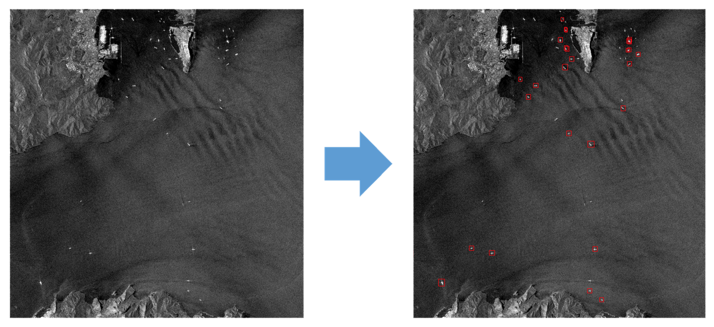
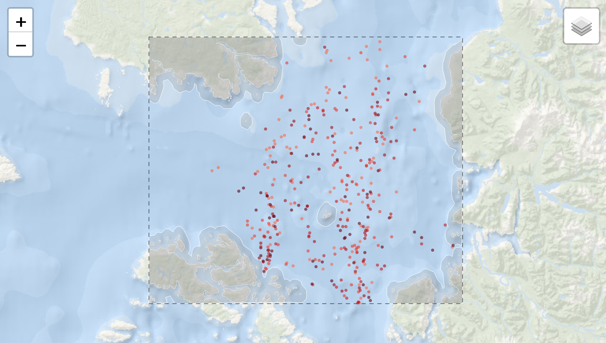
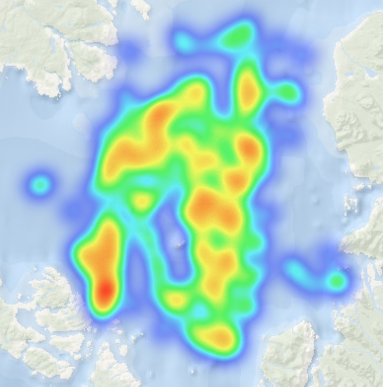
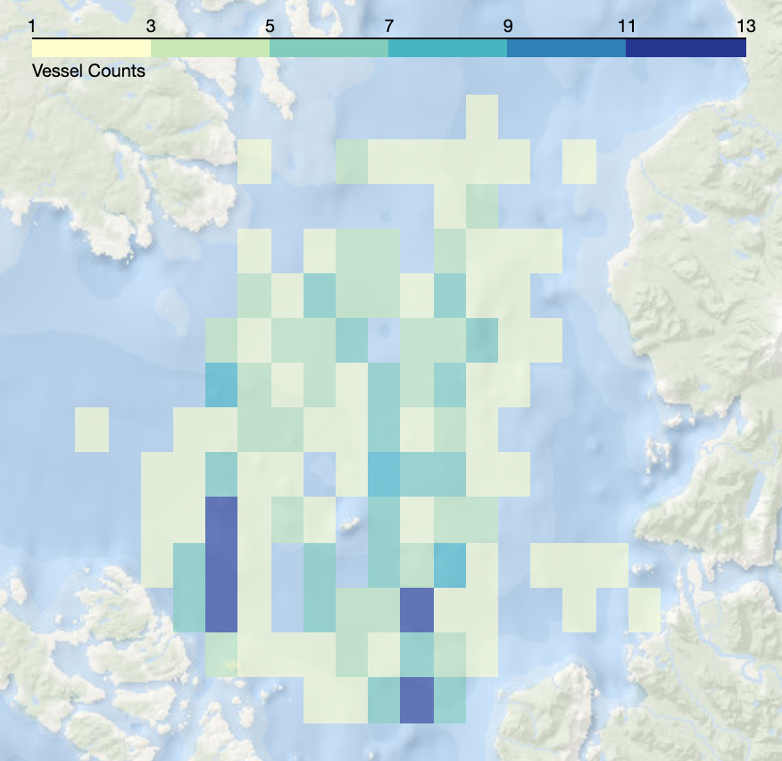
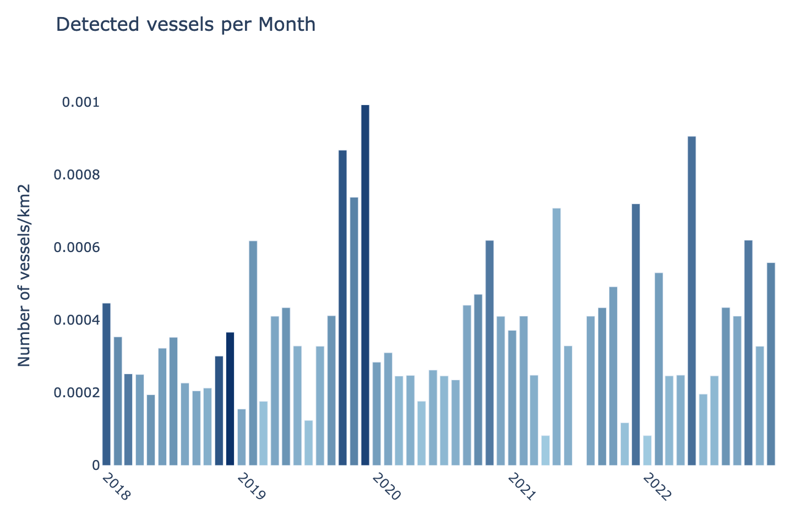

# Vessel detection in Synthetic Aperture Radar images using Faster R-CNN models: Advanced monitoring techniques to improve fisheries management

In this project, I developed a Faster R-CNN model to detect vessels from SAR images. The project involved comparing the model's performance by implementing various image pre-processing techniques. Furthermore, I integrated the model into an interactive report to test it with real-world Sentinel-1 data from the Copernicus Program and evaluated its potential for fisheries management through a case study.

Master's project link: <https://openaccess.uoc.edu/handle/10609/148471>

## The model

To train the model, a pre-annotated dataset, the Large-Scale SAR Ship Detection Dataset v1.0 (LS-SSDD-v1.0) by Zhang et al. (2020), was used. This dataset was selected as it is sizable enough for the training process while being manageable within the computational resources included in a free Colab account.

  

I used Detectron2 to construct the Faster R-CNN model. Data preprocessing included removing images without annotated vessels, splitting the dataset into training and testing sets, and registering the datasets within Detectron2. After some training and testing, the performance of the model was improved by applying various image pre-processing techniques, such as data augmentation. We augmented the input data by applying a variety of changes, including resizing, flipping, and adjusting the brightness, contrast, and saturation of the image. The trained model was then evaluated using the Common Objects in Context (COCO) Evaluator, and a custom evaluator.

## Case Study

The project also entailed streamlining the access of a vast array of Sentinel-1 images from Google Earth Engine. The creation of this workflow automated the detection process and the transformation of detected objects into derived data for subsequent statistical analysis.

  

Specifically, we applied the resulting model to a total of 348 images, amounting to 93GB of data, and processed it to evaluate a period from January 2018 to December 2022, covering 1024011 km2. The detection model was applied after reprojecting the images to a CRS of interest. The resulting bounding boxes from the model were converted into coordinate points, representing the precise locations of the detected vessels.

The derived data was analyzed to showcase the effective use of these advanced tools for maritime surveillance. Several subproducts such as heatmaps, density maps, or temporal series were generated.

     
     

You can find a summary of the case study in [my blog](https://pcarbomestre.github.io/blog-posts/SAR-Fisheries/blog-post_SAR-Fisheries.html).

## Acknowledgments

The success and execution of this project owe a great deal to the foundational work and code provided by several individuals. My gratitude goes to [\@jasonmanesis](https://github.com/jasonmanesis), [\@eikeschuett](https://github.com/eikeschuett), and [\@jakee417](https://github.com/jakee417). Their invaluable contributions have significantly facilitated each stage of this project.
